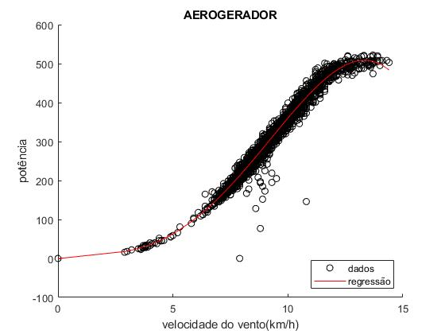
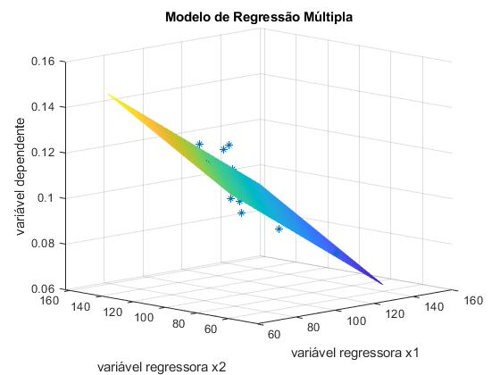

# Study_of_Linear_Regression_Models
study of linear regression and multiple regression algorithms using matlab without toolbox

## Technologies
- Matlab

## Datasets
Both datasets used to improve the linear regression and multiple regression models were provided by the Computer Intelligence professor from Federal University of Ceará - Brazil. The datasets are stored on datasets folder into this repository

- **Aerogerador.dat**
  - wind speed (feature)
  - provided power by aerogenerator (target)

- **Dados.dat** (random datas)
  - 2 regression variables (features)
  - 1 target 

## Results
Linear Regression Model (4th Degree)
- **R2:** 0.9737
- **R2_adj:** 0.9737
 

Multiple Regression Model
- **R2:** 0.7239
- **R2_adj:** 0.7239
 

